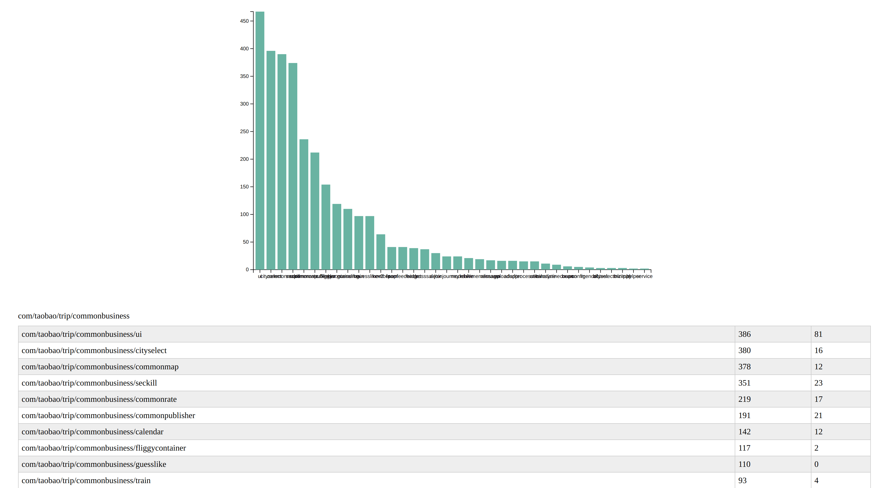

# apkextracter
项目简介：基于apk文件的包体积优化分析工具，用于分析apk应用包的体积优化空间

主要功能：
- cpd：基于apk的重复代码检测，用于应用包重复代码分析，
- confusion：识别应用代码中未混淆的私有字段和方法名，支持检测结果图表化展示
- assertless：打印应用中未被直接使用的assets文件
- appdiff：apk文件对比，打印出新增，删除，修改的文件和文件大小

# 环境搭建
`git clone https://github.com/yzhiwen/apkextracter && cd apkextracter/extracter && ./extracter`
> note：目前只在Ubuntu上运行验证，其他系统暂未验证


# 上手指南
```shell
Usage: extracter [options] apk

Options:
    cpd                         print apk copy instruction
    confusion                   print apk confusion info
    apkdiff [oldapk] [newapk]   print diff two apk file，oldapk newapk
    assetless                   print unused asset file in apk directly

cpd options:
    -h, --help                  show this help message and exit
    -t MINITOKENS, --minitokens=MINITOKENS
                                the lowest tokens, default: 100
    -p PACKAGE, --package=PACKAGE
                                specify the scan package name, default: all

confusion options:
    -v --viz                    confusion scan result visualization 
    -p --package [package]      specify the scan package name, '.' is all (default: apkpackage name)
```

# 检测结果输出
## cpd result
```
(base) ➜  extracter git:(8bd73df) ./extracter cpd ~/gitcode/apkextracter/extracter/_/apk/douyin.apk
__douyin.apk/smali_classes14/com/ss/android/ugc/aweme/dsp/playpage/widget/custom/b.smali
__douyin.apk/smali_classes14/com/ss/android/ugc/aweme/feed/utils/r.smali
with tokens number: 204

__douyin.apk/smali_classes6/com/ss/android/ugc/aweme/discover/mixfeed/viewholder/z.smali
__douyin.apk/smali_classes6/com/ss/android/ugc/aweme/discover/mixfeed/viewholder/bw.smali
__douyin.apk/smali_classes6/com/ss/android/ugc/aweme/discover/mixfeed/viewholder/bo.smali
with tokens number: 143

class total:  66851
method total:  214996
smali file walker time:  55.50656604766846
method hash time:  60.717487812042236
hash walker time:  60.53418302536011
```

## confusion result
